# AI Dataset Generator: Skill for Claude, Codex, and Antigravity

An AI dataset generator skill for agent IDEs, built around tool-native reasoning plus a deterministic local pipeline for normalization, verification, deduplication, export, and data-card generation.

**In Simple Terms:** This tool turns your AI coding assistant into an automated data engineer. You describe the dataset you need, and the agent researches examples, builds them in batches, rejects duplicates early, checks coverage while generating, applies semantic review, and exports a training-ready dataset (SFT or DPO).

## IDE Compatibility

- Antigravity IDE: project-local `.agent/skills/dataset-generator` or user-global `~/.gemini/antigravity/skills/dataset-generator`
- Claude Code: project-local `.claude/skills/dataset-generator` or user-global `~/.claude/skills/dataset-generator`
- Codex: project-local `.codex/skills/dataset-generator` or user-global `~/.codex/skills/dataset-generator`

## How it Works

The skill operates in a continuous agentic loop, splitting work between reasoning (LLM) and deterministic processing (local SQLite/scripts):

1. **Strategic Planning**: The agent analyzes your prompt, defines the output schema, sets an SFT or DPO target, and designs a multi-axis taxonomy aimed at long-tail edge cases.
2. **Research & Seeding**: Adhering to a research-first mandate, the agent fetches real-world examples (via IDE search or web tools) and drafts canonical records with explicit coverage metadata.
3. **Batch Build Loop**: `scripts/build_loop.py` can import draft batches, reject near-duplicates on import, run verification, and measure coverage after every batch so generation targets the missing buckets instead of overproducing the dominant case.
4. **Semantic Review**: The host IDE agent applies the `llm-judge` rubric through a `review.jsonl` file. Deterministic scripts gate structure and heuristics first, but semantic pass/fail still comes from the LLM review step.
5. **Final Audit & Export**: The pipeline performs final deduplication, split-safe export, and corpus-level audit checks such as leakage, taxonomy coverage, balance, and synthetic fingerprints.

## Current Inventory

- Specialized sub-skills: `12`
- Pipeline entry scripts: `8`
- Shared utility modules: `9`
- Internal canonical schema: `1`
- Preset export schemas: `3`
- Automated tests: `48`

## Features

| Capability | Description |
|-----------|-------------|
| `dataset collect` | Fetch content from web searches (5-backend fallback chain), explicit URLs, or local files/repos and emit canonical JSONL for agent-driven dataset creation |
| `dataset generate` | Topic-driven generation, URL/reference structuring, web-research capture, or raw dataset normalization into canonical records with effective-count and coverage steering |
| `dataset verify` | Heuristic checks, required-field/provenance enforcement, review-file adjudication, and audit-friendly DB-backed verification |
| `dataset audit` | Deep post-generation corpus-quality assessment (split disjointness, context leakage, taxonomy coverage, reasoning variety, synthetic fingerprint detection) |
| `dataset export` | OpenAI, HuggingFace, CSV, and flat JSONL export with automatic data-card generation |
| `dataset-strategy` | Request classification, taxonomy planning, `task_type` selection, and schema planning |
| `seed-generator` | Canonical draft creation for generated, URL-derived, research-derived, or imported datasets |
| `diversity-engine` | Coverage expansion via rewritten augmentations or deterministic metadata variants |
| `quality-filter` | Fast heuristic filtering for placeholders, refusals, weak records, and syntax checks |
| `llm-judge` | Structured review-file contract for semantic pass/fail judgments, behavioral delta, and self-bias mitigation |
| `dpo-pair-generator` | Generates contrastive preference pairs with hard negatives for Direct Preference Optimization (DPO) |
| `deduplicator` | Exact and semantic near-duplicate suppression before export |
| `formatter-exporter` | Preset and custom flat-schema mapping for final user-facing outputs |
| `dataset-auditor` | Evaluates full corpora for synthetic contamination, context leakage, balanced coverage, and holdout contamination |
| `local-collector` | Sub-skill that routes collection through IDE-native tools first, then falls back to `scripts/collect.py` |


## Installation (All IDEs)

Choose one of these install modes.

All `--online` commands below download the latest release package automatically.

### 1. Workspace Install (Recommended)

Use this when you want the skill inside a specific project.

This creates:

- `<project>/.agent/skills/dataset-generator`
- `<project>/.claude/skills/dataset-generator`
- `<project>/.codex/skills/dataset-generator`

**macOS / Linux (Bash):**
```bash
curl -sSL https://raw.githubusercontent.com/Bhanunamikaze/ai-dataset-generator/main/install.sh | bash -s -- --online --target all --project-dir /path/to/your/project
```

**Windows (PowerShell):**
```powershell
Invoke-Expression "& { $(Invoke-RestMethod 'https://raw.githubusercontent.com/Bhanunamikaze/ai-dataset-generator/main/install.ps1') } --online --target all --project-dir C:\path\to\your\project"
```

### 2. Global Install

Use this when you want one shared install for all projects on your machine.

This creates:

- `~/.gemini/antigravity/skills/dataset-generator`
- `~/.claude/skills/dataset-generator`
- `~/.codex/skills/dataset-generator`

**macOS / Linux (Bash):**
```bash
curl -sSL https://raw.githubusercontent.com/Bhanunamikaze/ai-dataset-generator/main/install.sh | bash -s -- --online --target global
```

**Windows (PowerShell):**
```powershell
Invoke-Expression "& { $(Invoke-RestMethod 'https://raw.githubusercontent.com/Bhanunamikaze/ai-dataset-generator/main/install.ps1') } --online --target global"
```

### 3. Install From a Local Checkout

Use this when you want to inspect or edit the repo before installing.

**macOS / Linux (Bash):**
```bash
git clone https://github.com/Bhanunamikaze/ai-dataset-generator.git
cd ai-dataset-generator

# Workspace install
bash install.sh --target all --project-dir /path/to/your/project

# Global install
bash install.sh --target global
```

**Windows (PowerShell):**
```powershell
git clone https://github.com/Bhanunamikaze/ai-dataset-generator.git
cd ai-dataset-generator

# Workspace install
pwsh ./install.ps1 --target all --project-dir C:\path\to\your\project

# Global install
pwsh ./install.ps1 --target global
```

### Install Only One IDE

Use `--target antigravity`, `--target claude`, or `--target codex`.

- With `--project-dir`, the install goes into that project's local `.agent`, `.claude`, or `.codex` folder.
- Without `--project-dir`, `antigravity` installs into the current directory and Claude/Codex install to the user-global home.

Example:

```bash
bash install.sh --target codex --project-dir /path/to/your/project
```

## Python dependency install:

```bash
python3 -m pip install -r requirements.txt
```

## Adversarial Security Datasets

The runtime sanitizer always strips control characters, but prompt-injection flagging can be relaxed when you are intentionally building red-team or jailbreak training corpora.

For red teaming, security, pentest, and jailbreak datasets, the scripts now enable this mode by default when the request text signals that intent.

Use the import flags below when you want to force the behavior explicitly:

```bash
python3 scripts/generate.py --input drafts.jsonl --source-type raw_dataset --allow-injections
python3 scripts/augment.py --input augmented.jsonl --source-type raw_dataset --allow-injections
python3 scripts/verify.py --input dataset.jsonl --source-type raw_dataset --allow-injections
```

Use `--enforce-security-flags` to opt back into strict flagging for those requests.

That bypasses prompt-injection regex flagging while preserving other normalization behavior.

## Real-World Grounding & Anti-Synthetic Quality

Standard LLM dataset generation often produces "synthetic-feeling" datasets (e.g., highly templated reasoning, perfectly polished but unnatural prompts, and context leakage). 

The pipeline is intentionally structured to avoid this via **Anti-Synthetic Guardrails**:

- **Research-First Sourcing**: The agent is mandated to prefer real-world source material (forum posts, issue trackers) over pure imagination, aiming for a >60% real-world grounding ratio.
- **Human Imperfection Injection**: Seed records are deliberately varied with typos, ambiguous phrasing, and casual formatting to prevent the model from overfitting to formal prompt templates.
- **Response Architecture Variety**: Responses are explicitly forced into diverse structures (e.g., Socratic pushback, code-first, disagreement) rather than repeating a fixed chain-of-thought skeleton.
- **Generation-Time Coverage Steering**: `scripts/coverage.py` measures effective post-dedup count, bucket gaps, and mode collapse while the dataset is still being built.
- **Plan-Driven Quality Gates**: the same coverage plan can now enforce required fields, provenance quotas, joint-bucket balance, and response-prefix repetition limits.
- **Model-Visibility Controls**: the export step can now sanitize model-visible `instruction` and `context` fields via plan-driven line removal and value redaction while preserving full metadata for audit use.
- **Import-Time Duplicate Rejection**: `scripts/generate.py --dedup-threshold ...` rejects semantic repeats before they can inflate the corpus.
- **Semantic Review Gate**: The final training set is expected to pass an LLM review step via `review.jsonl`; without that, records remain `judge_pending` rather than becoming `verified_pass`.
- **Corpus-Level Synthetic Audits**: Running `dataset audit` evaluates the corpus for telltale synthetic fingerprints (like uniform sentence lengths or repetitive openings) and structural mode collapse.

## Example Prompts

### How prompts route to the skill

You do not need to use explicit flags or command syntax. Natural-language prompts are enough.

- To get a production-sized dataset, just describe the dataset. If you do not specify a size, the skill should target `500` records.
- To get a larger or smaller dataset, state the number explicitly.
- To verify or export an existing dataset, say that directly and the skill should route into the DB-backed audit/export flow.

| You type... | Scope | Route | Main phases used |
|-------------|-------|-------|------------------|
| `Generate a medical triage dataset` | topic-driven generation | default-size generation | strategy -> seed -> build_loop -> export |
| `Generate a 2000-example customer support dataset in OpenAI JSONL` | topic-driven generation | user-sized generation | strategy -> seed -> build_loop -> export |
| `Turn these URLs into a training dataset` | URL/reference structuring | source-to-dataset conversion | strategy -> seed -> build_loop -> export |
| `Use web research to build a fintech FAQ dataset` | internet-research generation | research-driven generation | strategy -> seed -> build_loop -> export |
| `Normalize this CSV into OpenAI JSONL` | existing-dataset normalization | import and reshape | strategy -> seed -> verify -> export |
| `Verify and score this dataset.jsonl` | verify-only audit | audit flow | data-verifier -> verify -> dedup -> export |
| `Export the verified set with custom headers` | export-only | export shaping | formatter-exporter -> export |

### Prompt examples

**Basic SFT Generation**
```text
Generate a 1500-example legal intake dataset with hard edge cases and export it as CSV.
```

**Advanced DPO Generation with Reasoning**
```text
Generate a 1000-example DPO dataset for Python code review focusing on identifying subtle concurrency bugs. I will use this to train an LLM to act as an automated PR reviewer.

Each example should be structured as follows:
- Context: A snippet of Python code using `asyncio` or `threading` with a hidden race condition or deadlock.
- Instruction: "Please review this code for concurrency issues."
- Chosen Response: A <think> block with step-by-step reasoning that correctly identifies the root cause, followed by a polite explanation and fixed code.
- Rejected Response: A plausible-sounding review that misses the bug entirely or suggests a flawed "fix".

Ensure the dataset covers diverse real-world scenarios like asynchronous task cancellation, shared state mutations, and improper lock ordering. Export the dataset in HuggingFace format.
```

**Dataset Normalization / Import**
```text
Normalize this CSV into HuggingFace chat format and deduplicate it.
```

**Audit and Export**
```text
Verify this dataset, remove weak examples, and export custom columns: prompt, answer, persona, difficulty.
```


## Automated Pipeline

This repo is an automated pipeline for the deterministic stages:

1. import or seed canonical records
2. run a batch-wise build loop with import-time dedup and coverage checks
3. augment records
4. verify records, including plan-driven required-field and provenance gates when a coverage plan is supplied
5. apply semantic review from a `review.jsonl` file
6. deduplicate the passing set
7. export artifacts and generate a data card

## Coverage Plan Extensions

The coverage plan is now the generic quality-control contract for any dataset type, not just a bucket counter.

- `required_fields`: paths that every kept record must carry, for example `metadata.source_origin` or `metadata.response_family`
- `group_minimums`: single-axis minimums keyed by path
- `max_share_per_group`: single-axis mode-collapse ceiling
- `joint_group_rules`: optional multi-axis rules with `fields`, optional `minimums`, and optional `max_share`
- `provenance`: optional real-world grounding rules, including `minimum_real_world_share` and traceable `reference_fields`
- `response_length`: optional caps for median response size and the share of records above a maximum length
- `response_structure`: optional cap on one dominant response signature, useful when responses are JSON-shaped
- `response_prefix`: optional repeated-opening cap using `prefix_length` and `max_share`
- `model_visibility`: export-time sanitization rules for model-visible `instruction` and `context`, including line-prefix removal, line dropping based on answer-bearing field hits, and value redaction. If omitted, export now applies a conservative built-in profile by default; set `"enabled": false` to disable it.
- `require_review_file`: when `true`, `scripts/build_loop.py` refuses to run without `--review-file`

Advanced quality gates such as `provenance`, `response_length`, `response_structure`, and `response_prefix` are advisory by default. Set `blocking: true` inside a section only when you want that rule to stop the build loop from completing.

Those reasoning-heavy phases are handled by the host IDE agent via [`SKILL.md`](./SKILL.md) and [`sub-skills/`](./sub-skills/), which matches the Codex / Antigravity / Claude Code skill model.

`scripts/generate.py`, `scripts/coverage.py`, `scripts/build_loop.py`, and `scripts/export.py` are deterministic orchestration helpers. They do not call external LLM-provider APIs. Semantic judging still comes from the host agent via the review-file contract.

## Architecture



## LLM-First Workflow

This skill follows a reasoning-first pattern:

1. classify the user request
2. choose `task_type`, `source_type`, and output schema
3. collect evidence or draft canonical records
4. run deterministic scripts for stateful processing
5. export only validated, deduplicated artifacts

The fixed/flexible split is intentional:

- internal canonical schema: fixed
- final user-facing export schema: flexible

## Default Dataset Size

For generation requests, the default target size is `500` records unless the user explicitly asks for a different number or asks for a small prototype/sample.

Practical rule:

- no size specified -> target `500`
- explicit size specified -> honor the requested count
- explicit prototype/sample wording -> smaller output is acceptable

Why `500`:

- it is a practical default that is large enough to produce a usable first-pass dataset while still being realistic for a single agent-driven session

## Repository Docs

- [Architecture Notes](./docs/architecture.md)
- [Workflow Notes](./docs/workflows.md)
- [Primary Skill Contract](./SKILL.md)
- [Contributing Guide](./CONTRIBUTING.md)
- [Security Policy](./SECURITY.md)


## Roadmap

- Add a standalone `dataset card` command if users want card generation decoupled from export.
- Move toward stronger artifact versioning and per-run workspace layout once larger datasets become a primary use case.
